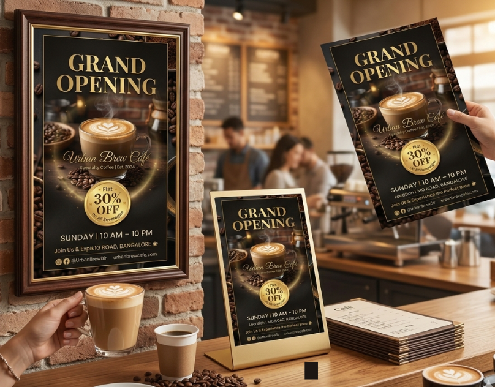

# Urban Brew Café – Grand Opening Poster Design ☕

A premium promotional poster designed for the grand opening of a modern specialty coffee café. This project showcases high-end typography, cinematic composition, and commercial promotional layout design.

---

## 📌 Project Overview

This poster was created for a fictional café brand called **Urban Brew Café** to promote its grand opening event and special discount offer.

The goal of this design was to:
- Create a premium and cozy visual atmosphere
- Highlight the promotional offer clearly
- Maintain strong typography hierarchy
- Use warm color psychology to match the coffee theme

---

## 🎯 Design Concept

The poster uses:
- Dark brown and black tones for a premium feel
- Gold accents to enhance elegance
- A central coffee cup image as the focal point
- Coffee beans as decorative framing elements
- A circular badge to emphasize the "30% OFF" offer

The lighting and glow effects create a cinematic and inviting mood.

---

## 🖌️ Tools Used

- Canva , Adobe Photoshop , Figma
- High-resolution stock images
- Custom typography styling
- Layer blending & shadow effects

---

## 🔤 Typography

- Heading Font: Elegant Serif (e.g., Playfair Display / Cinzel)
- Brand Name: Script Font for luxury feel
- Details: Clean Sans-serif (e.g., Poppins / Lato)

---

## 📐 Poster Details

- Size: A4 (Print Ready)
- Orientation: Vertical
- Color Mode: RGB (Can be converted to CMYK for print)
- Resolution: 300 DPI

---

## 💡 Skills Demonstrated

✔ Promotional Poster Design  
✔ Typography Hierarchy  
✔ Commercial Layout Design  
✔ Color Psychology  
✔ Branding & Visual Identity  
✔ Offer Highlight Strategy  

---

## 📷 Preview

---

## 📢 About This Project

This is a portfolio project created for showcasing graphic design and print design skills. The brand and event are fictional.

---

## 👩‍🎨 Designer

Shraddha  
Visual Identity & Print Designer  
